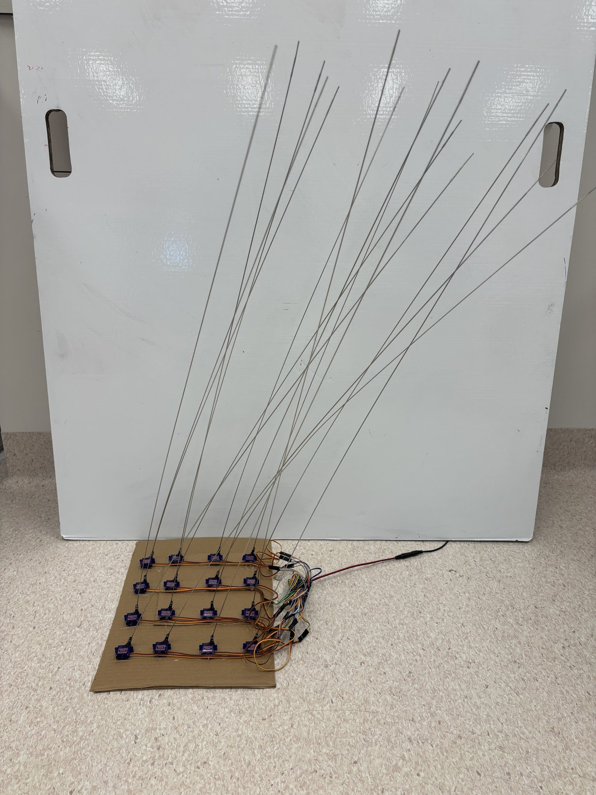
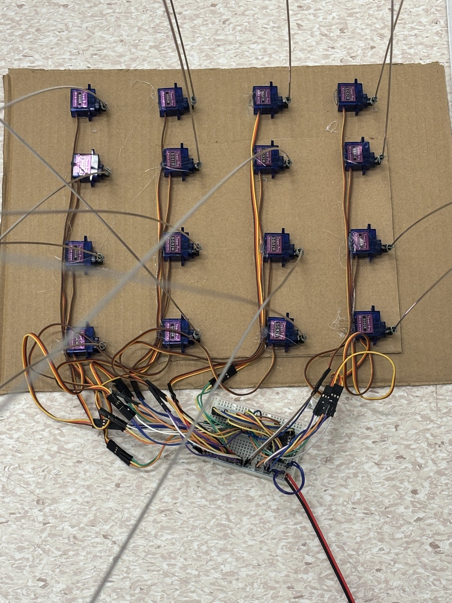
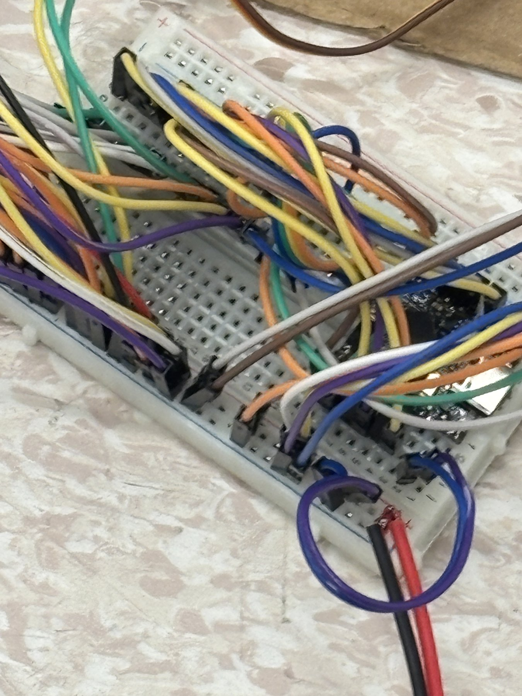

# polyp

The "notwled" project: servo patches arranged into a shared grid, with effects
(ripple, sweep, chase, wind, dominoes, breeze) running across the stitched
space the same way WLED's 2D panel setup does for LED matrices. See
[CLAUDE.md](CLAUDE.md) for the full concept.

**Naming:** Polyp is this firmware/software layer. The physical installation
built from it is what Sui calls **Tuft**, as in a grass tuft, not to be
confused with the separate ceiling-arm concept in the private
[tuft](../tuft) repo, which predates this build and is a different thing.

## Build

4x4 grid of SG92R servos, direct GPIO on an ESP32-S3 SuperMini (LEDC + MCPWM,
no PCA9685 needed up to 20 channels), 1100mm x 2mm stainless welding-rod
horns. Running the `breeze` effect: continuous, spatially-correlated sway
that crosses the grid rather than each stalk twitching independently.

Bring-up wiring, ESP32-S3 SuperMini plus breadboard driving all 16 channels
across LEDC and both MCPWM groups:

Firmware lives in [`firmware/`](firmware/), see its own history for the
bring-up (10-bit vs 14-bit PWM resolution, the S3's 8-channel LEDC limit,
extending to MCPWM for channels 9 onward).

## Console

**[sui001.github.io/polyp →](https://sui001.github.io/polyp/)**

Arrange boards, tune each servo (type, horn length/thickness/orientation,
mount tilt/pan), pick wall/floor/roof mounting aspect, run a directional
effect, then export the whole configuration as JSON, enough to hand to real
PCA9685 firmware. Repo is public so the free GitHub Pages plan can serve it;
there's no research/thesis content here, just the tool.

`index.html` at the repo root is what Pages serves, keep it in sync with
`visualizer/polyp-console.html` when the console changes.

Also live as a private Claude artifact:
[polyp console (Claude)](https://claude.ai/code/artifact/7287ed4f-2422-4c04-92ac-a139fcdd5c02).
